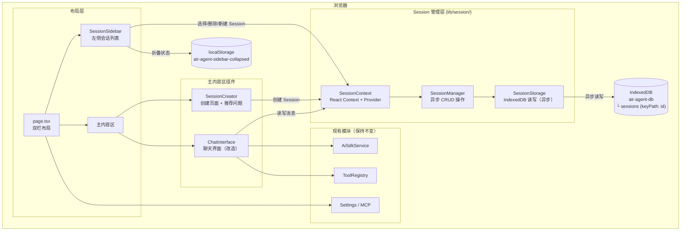
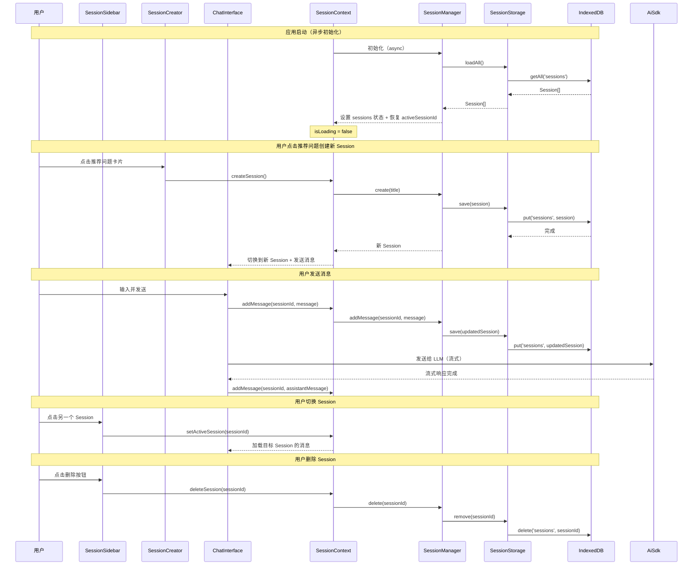

# 设计文档：聊天 Session 上下文存储

## 概述

本设计为 Air Agent 聊天应用引入完整的 Session 管理系统。核心变更是将 Session 数据的持久化存储从 localStorage 迁移到 IndexedDB，以突破 5MB 容量限制并支持大量对话历史。由于 IndexedDB 是异步 API，存储层的所有方法将返回 Promise，SessionManager 中涉及存储的方法也相应变为异步。侧边栏折叠状态等轻量配置仍使用 localStorage。

设计遵循以下原则：
- 存储层与 UI 层解耦，通过 React Context 连接
- 使用 `idb` npm 包封装 IndexedDB，提供简洁的 Promise API
- 最小化对现有 `chat-interface.tsx` 的侵入性修改
- 所有数据操作通过统一的 `SessionManager` 进行

## 架构

### 整体架构图



### 数据流图



## 组件与接口

### 1. SessionStorage（存储层 — IndexedDB）

文件路径：`lib/session/storage.ts`

职责：负责 Session 数据与 IndexedDB 之间的异步读写。使用 `idb` 包简化 IndexedDB 操作。

```typescript
import { openDB, type IDBPDatabase } from 'idb'

const DB_NAME = 'air-agent-db'
const DB_VERSION = 1
const SESSIONS_STORE = 'sessions'
const SIDEBAR_STATE_KEY = 'air-agent-sidebar-collapsed'

interface AirAgentDB {
  sessions: {
    key: string
    value: Session
  }
}

class SessionStorage {
  private dbPromise: Promise<IDBPDatabase<AirAgentDB>>

  constructor() {
    this.dbPromise = openDB<AirAgentDB>(DB_NAME, DB_VERSION, {
      upgrade(db) {
        if (!db.objectStoreNames.contains(SESSIONS_STORE)) {
          db.createObjectStore(SESSIONS_STORE, { keyPath: 'id' })
        }
      },
    })
  }

  // 从 IndexedDB 加载所有 Session
  async loadAll(): Promise<Session[]>

  // 保存单个 Session 到 IndexedDB（put 操作，存在则更新）
  async save(session: Session): Promise<void>

  // 保存多个 Session 到 IndexedDB（批量写入）
  async saveAll(sessions: Session[]): Promise<void>

  // 从 IndexedDB 删除指定 Session
  async remove(id: string): Promise<void>

  // 加载侧边栏折叠状态（仍使用 localStorage，同步）
  loadSidebarCollapsed(): boolean

  // 保存侧边栏折叠状态（仍使用 localStorage，同步）
  saveSidebarCollapsed(collapsed: boolean): void
}
```

设计决策：
- 从"所有 Session 存储在一个 localStorage key"改为"每个 Session 作为 IndexedDB 中的独立记录"，以 `id` 为 keyPath
- 新增 `save(session)` 方法用于单个 Session 的 put 操作，避免每次都写入全部数据
- 新增 `remove(id)` 方法用于单个 Session 的删除，无需加载全部数据再保存
- 保留 `saveAll` 用于批量操作场景
- 侧边栏折叠状态仍使用 localStorage（仅一个布尔值，无需 IndexedDB）

### 2. SessionManager（业务逻辑层 — 异步）

文件路径：`lib/session/manager.ts`

职责：Session 的 CRUD 操作和业务规则。由于存储层变为异步，涉及持久化的方法均返回 Promise。

```typescript
class SessionManager {
  private storage: SessionStorage
  private sessions: Session[]
  private _activeSessionId: string | null

  // 异步初始化：从 IndexedDB 加载所有 Session
  async init(): Promise<void>

  // 获取所有 Session（按 updatedAt 降序），内存操作，同步
  getAllSessions(): Session[]

  // 根据 ID 获取 Session，内存操作，同步
  getSession(id: string): Session | undefined

  // 创建新 Session（异步持久化）
  async createSession(title?: string): Promise<Session>

  // 删除 Session（异步持久化）
  async deleteSession(id: string): Promise<void>

  // 向 Session 添加消息（异步持久化）
  async addMessage(sessionId: string, message: SessionMessage): Promise<void>

  // 更新 Session 标题（异步持久化）
  async updateTitle(sessionId: string, title: string): Promise<void>

  // 基于第一条消息自动生成标题（纯计算，同步）
  generateTitle(firstMessage: string): string
}
```

设计决策：
- 构造函数不再同步加载数据，改为通过 `init()` 异步初始化
- 读取操作（`getAllSessions`、`getSession`）仍为同步，从内存缓存读取
- 写入操作（`createSession`、`deleteSession`、`addMessage`、`updateTitle`）变为异步
- 每次写入操作先更新内存缓存，再异步持久化到 IndexedDB
- `generateTitle` 为纯计算函数，保持同步

### 3. SessionContext（React Context — 处理异步初始化）

文件路径：`lib/session/context.tsx`

职责：为 React 组件树提供 Session 状态和操作方法，处理异步加载状态。

```typescript
interface SessionContextValue {
  // 状态
  sessions: Session[]
  activeSessionId: string | null
  activeSession: Session | null
  isLoading: boolean  // 新增：IndexedDB 异步加载状态

  // 操作（均为异步）
  createSession: (title?: string) => Promise<Session>
  deleteSession: (id: string) => Promise<void>
  setActiveSession: (id: string) => void
  addMessage: (message: SessionMessage) => Promise<void>
  updateSessionTitle: (id: string, title: string) => Promise<void>
}
```

设计决策：
- 新增 `isLoading` 状态，在 IndexedDB 数据加载完成前为 `true`
- Provider 在 `useEffect` 中调用 `SessionManager.init()` 完成异步初始化
- 所有写入操作返回 Promise，调用方可 await 确保持久化完成
- `setActiveSession` 保持同步（仅更新内存状态）

### 4. SessionSidebar（侧边栏组件）

文件路径：`components/session-sidebar.tsx`

职责：展示 Session 列表，支持切换、删除、新建。（与之前设计一致，无变更）

```typescript
interface SessionSidebarProps {
  collapsed: boolean
  onToggleCollapse: () => void
}
```

### 5. SessionCreator（创建页面组件）

文件路径：`components/session-creator.tsx`

职责：展示推荐问题卡片和自定义输入框。（与之前设计一致，无变更）

```typescript
interface SessionCreatorProps {
  onStartSession: (message: string) => void
  apiKeyConfigured: boolean
}
```

### 6. 改造后的页面布局

文件路径：`app/page.tsx`（改造）

```
┌──────────────────────────────────────────────┐
│ ┌──────────┐ ┌─────────────────────────────┐ │
│ │ Sidebar  │ │      Main Content Area      │ │
│ │          │ │                             │ │
│ │ [新建]   │ │  Loading... (isLoading时)   │ │
│ │          │ │  SessionCreator (无活跃时)  │ │
│ │ Session1 │ │       或                    │ │
│ │ Session2 │ │  ChatInterface (有活跃时)   │ │
│ │ Session3 │ │                             │ │
│ │ ...      │ │                             │ │
│ │          │ │  ┌─────────────────────┐    │ │
│ │          │ │  │   Settings Button   │    │ │
│ │          │ │  └─────────────────────┘    │ │
│ └──────────┘ └─────────────────────────────┘ │
└──────────────────────────────────────────────┘
```

新增：`isLoading` 状态下显示加载指示器，等待 IndexedDB 数据加载完成。

## 数据模型

### Session 数据结构

```typescript
// lib/session/types.ts

interface SessionMessage {
  id: string                          // UUID
  role: "user" | "assistant" | "tool" | "system"
  content: string
  timestamp: string                   // ISO 8601
  type?: "transitive-thought"         // 保留自定义类型
  tool_calls?: ToolCall[]             // 工具调用信息
  tool_call_id?: string               // 工具调用 ID
  name?: string                       // 工具名称
}

interface Session {
  id: string                          // UUID，同时作为 IndexedDB keyPath
  title: string                       // 会话标题
  messages: SessionMessage[]          // 消息列表
  createdAt: string                   // ISO 8601
  updatedAt: string                   // ISO 8601
}
```

注意：不再需要 `SessionStorageData` 包装类型。在 localStorage 方案中，所有 Session 被包装在一个 JSON 对象中存储在单个 key 下。在 IndexedDB 方案中，每个 Session 作为独立记录存储在 "sessions" object store 中，无需包装。

### 与现有 Message 类型的映射

```typescript
// 转换函数保持不变
function toSessionMessage(msg: ChatMessage): SessionMessage { ... }
function fromSessionMessage(msg: SessionMessage): ChatMessage { ... }
```

### IndexedDB 数据库结构

| 数据库 | 版本 | Object Store | keyPath | 说明 |
|--------|------|-------------|---------|------|
| `air-agent-db` | 1 | `sessions` | `id` | 每个 Session 作为独立记录 |

### localStorage 存储结构（仅保留轻量配置）

| Key | 值类型 | 说明 |
|-----|--------|------|
| `air-agent-sidebar-collapsed` | `"true"` \| `"false"` | 侧边栏折叠状态 |
| `air-agent-settings` | (现有) | 应用设置 |
| `air-agent-mcp-servers` | (现有) | MCP 服务器配置 |
| `air-agent-mcp-chat-settings` | (现有) | MCP 聊天设置 |


## 正确性属性

*正确性属性是一种在系统所有有效执行中都应成立的特征或行为——本质上是关于系统应该做什么的形式化陈述。属性是人类可读规范与机器可验证正确性保证之间的桥梁。*

### Property 1: Session 数据结构完整性

*For any* 新创建的 Session，该 Session 应包含非空的 UUID 格式 id、string 类型的 title、空数组 messages、有效的 ISO 8601 格式 createdAt 和 updatedAt；且其中每条 SessionMessage 应包含非空 id、有效的 role、string 类型的 content 和有效的 ISO 8601 格式 timestamp。

**Validates: Requirements 1.1, 1.2, 1.4**

### Property 2: Session ID 唯一性

*For any* N 个通过 SessionManager.createSession() 创建的 Session，所有 Session 的 id 应互不相同。

**Validates: Requirements 1.3**

### Property 3: Session 数据 IndexedDB 往返一致性

*For any* 包含任意数量消息（包括带 tool_calls 的消息、带 transitive-thought 类型的消息、带 tool_call_id 的工具结果消息）的有效 Session 对象，将其通过 SessionStorage.save() 写入 IndexedDB 后再通过 loadAll() 读取，应产生与原始对象深度相等的结果。

**Validates: Requirements 2.3, 7.1, 7.2**

### Property 4: 消息添加后异步持久化

*For any* Session 和任意有效消息，调用 SessionManager.addMessage() 并 await 完成后，从 IndexedDB 重新加载该 Session 应包含刚添加的消息。

**Validates: Requirements 2.1**

### Property 5: 新建 Session 成为活跃 Session

*For any* 当前 Session 列表状态，调用 createSession() 并 await 完成后，新创建的 Session 应成为 activeSessionId 指向的 Session。

**Validates: Requirements 3.1**

### Property 6: 删除 Session 后数据完全移除

*For any* 存在于列表中的 Session，调用 deleteSession(id) 并 await 完成后，该 id 不应出现在 getAllSessions() 的结果中，且从 IndexedDB 重新加载也不应包含该 Session。

**Validates: Requirements 3.3**

### Property 7: 删除活跃 Session 后自动切换

*For any* 包含至少两个 Session 的列表，当删除当前活跃 Session 并 await 完成后，activeSessionId 应自动切换到剩余 Session 中 updatedAt 最新的那个。当删除后列表为空时，activeSessionId 应为 null。

**Validates: Requirements 3.4**

### Property 8: 首条消息自动生成标题

*For any* 非空字符串作为 Session 的第一条用户消息，generateTitle 应返回一个非空字符串，且长度不超过 30 个字符，且是原始消息内容的前缀（可能带省略号）。

**Validates: Requirements 3.5**

### Property 9: Session 列表按更新时间降序排列

*For any* 包含多个不同 updatedAt 值的 Session 列表，getAllSessions() 返回的结果应满足：对于任意相邻的两个元素 sessions[i] 和 sessions[i+1]，sessions[i].updatedAt >= sessions[i+1].updatedAt。

**Validates: Requirements 4.2**

### Property 10: 侧边栏折叠状态往返一致性

*For any* 布尔值 collapsed，调用 saveSidebarCollapsed(collapsed) 后再调用 loadSidebarCollapsed()，应返回与原始值相同的布尔值。

**Validates: Requirements 4.7**

### Property 11: Session 切换后消息完整恢复

*For any* 两个包含消息的 Session A 和 B，从 A 切换到 B 再切换回 A 后，A 的消息列表应与切换前完全一致（包括消息数量、内容、顺序和所有字段）。

**Validates: Requirements 3.2, 7.3**

### Property 12: 存储中不包含 system 消息

*For any* Session 在 IndexedDB 中的存储数据，其 messages 数组中不应包含 role 为 "system" 的消息。

**Validates: Requirements 7.5**

## 错误处理

| 场景 | 处理方式 |
|------|----------|
| 用户未配置 API Key | SessionCreator 页面禁用推荐问题卡片和输入框，显示"请先在设置中配置 API Key"提示；ChatInterface 保持现有的禁用输入 + 提示行为 |
| IndexedDB 打开失败（浏览器不支持或隐私模式限制） | 记录 `console.error`，返回空 Session 列表，UI 显示存储不可用提示 |
| IndexedDB 数据读取失败 | 记录 `console.error`，返回空 Session 列表，不影响应用启动 |
| IndexedDB 写入事务中止（TransactionAbortError） | 捕获异常，通过 UI 提示用户存储操作失败，建议重试 |
| IndexedDB 数据库版本升级被阻塞（VersionChangeBlocked） | 提示用户关闭其他使用该数据库的标签页 |
| Session ID 不存在（getSession 返回 undefined） | 调用方检查返回值，不执行后续操作 |
| 删除不存在的 Session | 静默忽略，不抛出异常 |
| 消息添加到不存在的 Session | 静默忽略，记录 `console.warn` |
| 异步操作期间组件卸载 | 使用 AbortController 或 mounted flag 防止状态更新 |

## 测试策略

### 属性测试（Property-Based Testing）

使用 `fast-check` 库进行属性测试，每个属性至少运行 100 次迭代。

测试文件：
- `__tests__/session/storage.property.test.ts` — SessionStorage 属性测试
- `__tests__/session/manager.property.test.ts` — SessionManager 属性测试

使用 `fake-indexeddb` 包模拟 IndexedDB 环境，在 Node.js 测试环境中提供完整的 IndexedDB API。

需要实现的属性测试：
- **Property 3**（IndexedDB 往返一致性）是最关键的属性，需要生成包含各种消息类型的随机 Session
- **Property 2**（ID 唯一性）生成批量 Session 验证
- **Property 9**（排序）生成随机时间戳的 Session 列表验证排序
- **Property 8**（标题生成）生成随机字符串验证截取规则

每个测试需要标注对应的设计属性：
```typescript
// Feature: chat-session-storage, Property 3: Session 数据 IndexedDB 往返一致性
```

### 单元测试

使用 `vitest` 进行单元测试。

测试文件：
- `__tests__/session/storage.test.ts` — SessionStorage 单元测试
- `__tests__/session/manager.test.ts` — SessionManager 单元测试

重点覆盖：
- 边界情况：空 Session 列表、单个 Session、IndexedDB 数据库为空
- 错误条件：IndexedDB 打开失败、事务中止、数据库被阻塞
- 具体示例：创建 Session、添加消息、删除 Session、切换 Session
- 异步行为：确保所有 async 方法正确 await

### 测试配置

- 属性测试最少 100 次迭代
- 使用 `fake-indexeddb` 模拟 IndexedDB（在测试 setup 中注入 `globalThis.indexedDB`）
- 侧边栏折叠状态测试仍使用 localStorage mock
- 每个测试用例独立，测试前清空 IndexedDB 数据库
- 所有涉及存储的测试用例使用 `async/await`
