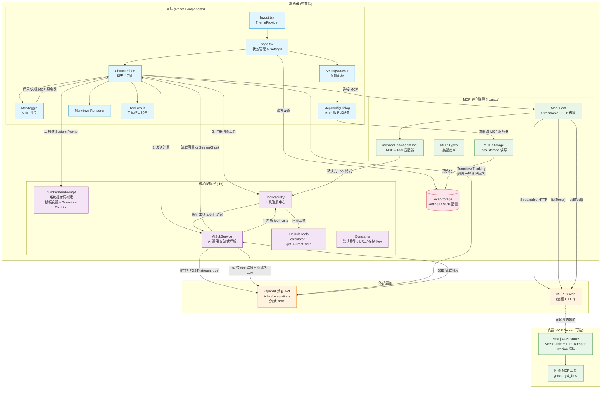

# Air Agent 架构图

## 核心数据流说明

### AI 调用流程
1. 用户输入消息 → `ChatInterface` 捕获
2. `buildSystemPrompt` 构建系统提示词（支持模板变量 + Transitive Thinking）
3. 若开启 Transitive Thinking，先发一轮"推理链"请求，再发正式请求
4. `AiSdkService.sendMessage()` 通过 `fetch` 调用 OpenAI 兼容 API（流式 SSE）
5. 流式解析 `data: {...}` 块，实时更新 UI

### Tool Call 自动循环
1. LLM 返回 `tool_calls` → `AiSdkService` 解析
2. 通过 `ToolRegistry.executeTool()` 执行工具（内置工具或 MCP 工具）
3. 将工具结果作为 `role: "tool"` 消息追加到对话
4. 再次请求 LLM，直到无 tool_calls 或达到最大迭代次数（默认 5）

### MCP 集成流程
1. 用户在 `McpConfigDialog` 中配置 MCP 服务器（URL、API Key），存入 localStorage
2. 在 `McpToggle` 中启用并选择服务器
3. `ChatInterface` 创建 `McpClient`，通过 Streamable HTTP 连接 MCP 服务器
4. `listTools()` 获取远程工具列表
5. `mcpToolToAirAgentTool()` 将 MCP 工具适配为统一的 `Tool` 格式，注册到 `ToolRegistry`
6. 之后 LLM 可以像调用内置工具一样调用 MCP 工具

### 存储
所有配置（API Key、模型、MCP 服务器列表等）均存储在浏览器 `localStorage` 中，无后端依赖。
