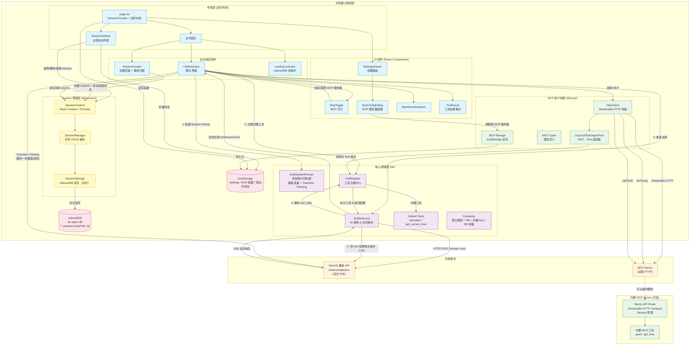

# Air Agent 架构图



## 核心数据流说明

### Session 管理流程

1. 应用启动时，`SessionProvider` 在 `useEffect` 中异步初始化 `SessionManager`
2. `SessionManager.init()` 通过 `SessionStorage.loadAll()` 从 IndexedDB 加载所有 Session
3. 加载完成前 `isLoading = true`，页面显示加载指示器
4. 加载完成后，若有 Session 则自动激活最近更新的 Session；若无则显示 `SessionCreator` 创建页面

### Session 创建与消息发送

1. 用户在 `SessionCreator` 中点击推荐问题卡片或输入自定义问题
2. `page.tsx` 先设置 `initialMessage`，再调用 `createSession()` 创建新 Session
3. `ChatInterface` 挂载后检测到 `initialMessage`，自动发送第一条消息
4. 第一条消息发送后自动生成 Session 标题（截取前 30 字符）
5. 每条消息完成后通过 `addMessage()` 异步持久化到 IndexedDB

### AI 调用流程

1. 用户输入消息 → `ChatInterface` 捕获
2. 用户消息立即通过 `addMessage()` 持久化到 Session
3. `buildSystemPrompt` 构建系统提示词（支持模板变量 + Transitive Thinking）
4. 若开启 Transitive Thinking，先发一轮"推理链"请求，再发正式请求
5. `AiSdkService.sendMessage()` 通过 `fetch` 调用 OpenAI 兼容 API（流式 SSE）
6. 流式解析 `data: {...}` 块，实时更新 UI（streaming messages 仅存在于本地状态）
7. 流式响应完成后，所有 assistant/tool 消息一次性持久化到 Session（不保存中间流式状态）

### Tool Call 自动循环

1. LLM 返回 `tool_calls` → `AiSdkService` 解析
2. 通过 `ToolRegistry.executeTool()` 执行工具（内置工具或 MCP 工具）
3. 将工具结果作为 `role: "tool"` 消息追加到对话
4. 再次请求 LLM，直到无 tool_calls 或达到最大迭代次数（默认 5）

### MCP 集成流程

1. 用户在 `McpConfigDialog` 中配置 MCP 服务器（URL、API Key），存入 localStorage
2. 在 `McpToggle` 中启用并选择服务器
3. `ChatInterface` 创建 `McpClient`，通过 Streamable HTTP 连接 MCP 服务器
4. `listTools()` 获取远程工具列表
5. `mcpToolToAirAgentTool()` 将 MCP 工具适配为统一的 `Tool` 格式，注册到 `ToolRegistry`
6. 之后 LLM 可以像调用内置工具一样调用 MCP 工具

### 存储架构

应用采用双存储策略：

| 存储方式 | 用途 | 特点 |
|----------|------|------|
| IndexedDB (`air-agent-db`) | Session 数据（消息历史） | 异步、大容量、每个 Session 独立记录 |
| localStorage | 设置、MCP 配置、侧边栏折叠状态 | 同步、轻量配置 |

IndexedDB 数据库结构：

| 数据库 | 版本 | Object Store | keyPath | 说明 |
|--------|------|-------------|---------|------|
| `air-agent-db` | 1 | `sessions` | `id` | 每个 Session 作为独立记录 |

localStorage 存储键：

| Key | 值类型 | 说明 |
|-----|--------|------|
| `air-agent-settings` | JSON | API Key、模型、系统提示词等应用设置 |
| `air-agent-mcp-servers` | JSON | MCP 服务器配置列表 |
| `air-agent-mcp-chat-settings` | JSON | MCP 启用状态和选中服务器 |
| `air-agent-sidebar-collapsed` | `"true"` \| `"false"` | 侧边栏折叠状态 |

## 页面布局

```
┌──────────────────────────────────────────────┐
│ ┌──────────┐ ┌─────────────────────────────┐ │
│ │ Sidebar  │ │      Main Content Area      │ │
│ │          │ │                             │ │
│ │ [折叠]   │ │  Loading... (isLoading时)   │ │
│ │ [新建]   │ │  SessionCreator (无活跃时)  │ │
│ │          │ │       或                    │ │
│ │ Session1 │ │  ChatInterface (有活跃时)   │ │
│ │ Session2 │ │                             │ │
│ │ Session3 │ │                             │ │
│ │ ...      │ │  ┌─────────────────────┐    │ │
│ │          │ │  │  Settings Drawer    │    │ │
│ │          │ │  └─────────────────────┘    │ │
│ └──────────┘ └─────────────────────────────┘ │
└──────────────────────────────────────────────┘
```

- 侧边栏支持折叠/展开，折叠时仅显示图标按钮
- 屏幕宽度 < 768px 时侧边栏默认折叠，展开时以 overlay 方式显示（带半透明背景遮罩）
- `SettingsDrawer` 位于顶部，不受侧边栏影响

## 数据模型

### Session 数据结构

```typescript
interface SessionMessage {
  id: string                          // UUID
  role: "user" | "assistant" | "tool" | "system"
  content: string
  timestamp: string                   // ISO 8601
  type?: "transitive-thought"         // Transitive Thinking 推理链
  tool_calls?: ToolCall[]             // 工具调用信息
  tool_call_id?: string               // 工具调用 ID
  name?: string                       // 工具名称
}

interface Session {
  id: string                          // UUID，同时作为 IndexedDB keyPath
  title: string                       // 会话标题（自动生成或默认"新会话"）
  messages: SessionMessage[]          // 消息列表（不含 system prompt）
  createdAt: string                   // ISO 8601
  updatedAt: string                   // ISO 8601
}
```

### 消息持久化规则

- 仅存储用户可见的消息（user、assistant、tool），不存储 system prompt
- 流式响应仅在完成后才持久化，避免保存不完整的中间状态
- tool_calls、transitive-thought 等特殊字段完整保存和恢复

## 模块目录结构

```
lib/
├── ai-sdk.ts              # AI SDK 服务（流式调用 + 工具执行循环）
├── constants.ts           # 常量定义（存储 Key、DB 名称、默认值）
├── prompt-template.ts     # 系统提示词构建
├── utils.ts               # 通用工具函数
├── mcp/                   # MCP 客户端层
│   ├── client.ts          # McpClient（Streamable HTTP 传输）
│   ├── index.ts           # 模块导出
│   ├── storage.ts         # MCP 配置 localStorage 读写
│   └── types.ts           # MCP 类型定义
├── session/               # Session 管理层
│   ├── context.tsx        # SessionContext + SessionProvider（React Context）
│   ├── index.ts           # 模块导出
│   ├── manager.ts         # SessionManager（异步 CRUD + 业务规则）
│   ├── storage.ts         # SessionStorage（IndexedDB 异步读写层）
│   └── types.ts           # Session/SessionMessage 类型 + 转换函数
└── tools/                 # 工具系统
    ├── default-tools.ts   # 内置工具（calculator、get_current_time）
    ├── index.ts           # 模块导出
    ├── registry.ts        # ToolRegistry（工具注册中心）
    └── types.ts           # 工具类型定义

components/
├── chat-interface.tsx     # 聊天主界面（集成 Session 系统）
├── markdown-renderer.tsx  # Markdown 渲染
├── mcp-config-dialog.tsx  # MCP 服务器配置对话框
├── mcp-toggle.tsx         # MCP 开关
├── session-creator.tsx    # Session 创建页面（推荐问题 + 自定义输入）
├── session-sidebar.tsx    # 左侧 Session 侧边栏
├── settings-dialog.tsx    # 设置对话框
├── settings-drawer.tsx    # 设置抽屉
├── theme-provider.tsx     # 主题 Provider
├── theme-selector.tsx     # 主题选择器
├── tool-result.tsx        # 工具结果展示
└── ui/                    # shadcn/ui 基础组件

app/
├── layout.tsx             # 根布局（ThemeProvider）
├── page.tsx               # 主页面（SessionProvider + 双栏布局 + 状态管理）
└── globals.css            # 全局样式
```
